

[![Contributors][contributors-shield]][contributors-url]
[![Forks][forks-shield]][forks-url]
[![Stargazers][stars-shield]][stars-url]
[![Issues][issues-shield]][issues-url]
[![Unlicense License][license-shield]][license-url]
[![LinkedIn][linkedin-shield]][linkedin-url]

   <h1>🚀 Two-Tier WebApp</h1>
   

      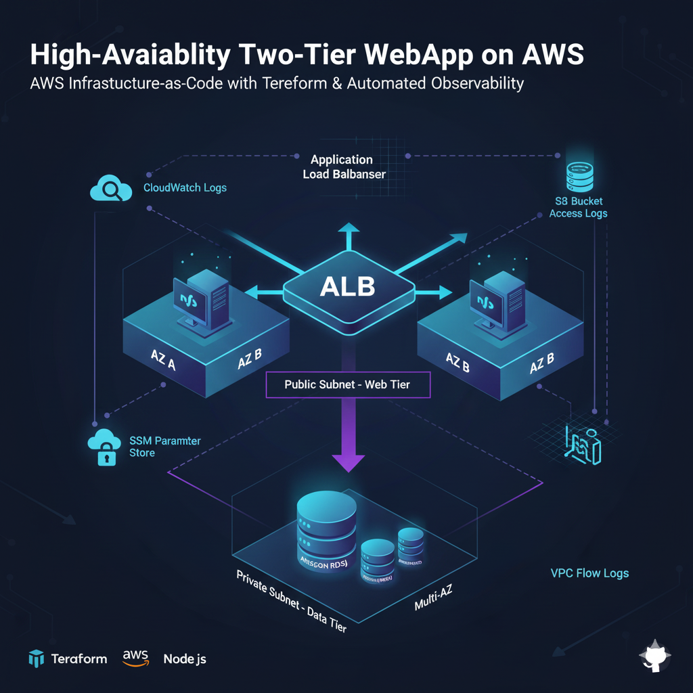  
      <strong>A Resilient Node.js Application with Automated Scaling and Real-Time Observability</strong>
   

 

 
[![Infrastructure CI][ci-shield]][ci-url]
[![Production Deployment][cd-shield]][cd-url]
[![Update Documentation][docs-shield]][docs-url]

 

<a href="#about-the-project"><strong>Explore the docs »</strong></a>

   
Table of Contents

   <ol>
      <li><a href="#about-the-project">About The Project</a></li>
      <li><a href="#built-with">Built With</a></li>
      <li><a href="#use-cases">Use Cases</a></li>
      <li><a href="#architecture">Architecture</a></li>
      <li><a href="#file-structure">File Structure</a></li>
      <li><a href="#technical">Technical Reference</a></li>
      <li><a href="#getting-started">Getting Started</a></li>
      <li><a href="#gitops">GitOps & CI/CD Workflow</a></li>
      <li><a href="#usage">Usage</a></li>
      <li><a href="#roadmap">Roadmap</a></li>
      <li><a href="#challenges-faced">Challenges</a></li>
      <li><a href="#well-architected">Well Architected Framework</a></li>
      <li><a href="#acknowledgements">Acknowledgements</a></li>
   </ol>

<h2 id="about-the-project">About The Project</h2>

This project demonstrates a production-ready <strong>Two-Tier Architecture</strong> deployed on AWS using <strong>Terraform</strong>. It features a Node.js web application running on a fleet of EC2 instances managed by an <strong>Auto Scaling Group (ASG)</strong> for high availability and a <strong>Multi-AZ RDS MySQL</strong> database for data persistence.

The core focus of this implementation is <strong>Operational Excellence</strong>. By integrating the <strong>CloudWatch Agent</strong> via <strong>SSM Parameter Store</strong>, the infrastructure automatically captures system logs and application health metrics, providing deep visibility into the environment without manual configuration of individual servers.

<a href="#readme-top">↑ Back to Top</a>

<h2 id="built-with">Built With</h2>
<ol>
   <li>
      <h3>Infrastructure as Code (IaC) & Backend</h3>
      

         
      

      

      <ul>
         <li><strong>Terraform & Terraform Cloud:</strong> Orchestrates the entire lifecycle of the AWS resources. State is managed remotely in Terraform Cloud to enable team collaboration and safe state-locking.</li>
         <li><strong>HCL (HashiCorp Configuration Language):</strong> Used to define modular resources (VPC, EC2, RDS) for high reusability.</li>
      </ul>
   </li>
   <li>
      <h3>Compute & Application Layer</h3>
      

         
         
         
      

      <ul>
         <li><strong>Node.js & Express:</strong> The core application engine handling RESTful CRUD operations.</li>
         <li><strong>Auto Scaling Group (ASG):</strong> Ensures high availability by maintaining a minimum of 2 instances across multiple Availability Zones (AZs).</li>
         <li><strong>Launch Templates:</strong> Standardizes the "Golden Image" configuration, including instance tags, IAM profiles, and UserData.</li>
         <li><strong>Application Load Balancer (ALB):</strong> Acts as the single entry point, distributing traffic and performing health checks to ensure users never hit a failing server.</li>
      </ul>
   </li>
   <li>
      <h3>Data & Networking Tier</h3>
      

         
         
         
         
      

      <ul>
         <li><strong>Amazon RDS (MySQL):</strong> A managed database instance residing in a Private Subnet Group, isolated from the public internet.</li>
         <li>
            <strong>Custom VPC Architecture:</strong> Ensures high availability by maintaining a minimum of 2 instances across multiple Availability Zones (AZs).
            <ul>
               <li><strong>Public Subnets:</strong> Hosting the ALB and (temporarily) the EC2 instances.</li>
               <li><strong>Private Subnets:</strong> Dedicated to data persistence.</li>
               <li><strong>Internet Gateway (IGW):</strong> Enables external connectivity for the web tier.</li>
               <li><strong>Route Tables:</strong> Manages the traffic flow between the internet and internal subnets.</li>
            </ul>
         </li>
         <li><strong>CloudWatch Logs:</strong> Dedicated log group for flow analysis, providing a complete audit trail for security and compliance.</li>
      </ul>
   </li>
   <li>
      <h3>Observability & Management</h3>
      

         
         
         
         
         
      

      <ul>
         <li><strong>AWS Systems Manager (SSM) Parameter Store:</strong> Centrally stores the CloudWatch Agent JSON configuration, allowing for "Configuration-as-Code" updates.</li>
         <li><strong>CloudWatch Logs:</strong> Centralized log repository for application journals and <code>cloud-init</code> output.</li>
         <li><strong>Amazon S3:</strong> Used for <strong>ALB Access Logging</strong>. Every request processed by the load balancer is logged as a gzipped file, capturing client IPs, request paths, and server response times for deep traffic analysis.</li>
         <li><strong>IAM Roles & Instance Profiles:</strong> Implements Least Privilege Access, granting EC2 only the permissions needed to write to CloudWatch and read from SSM.</li>
         <li><strong>VPC Flow Logs:</strong> Captures IP traffic metadata (source/destination IPs, ports, and protocols) for all network interfaces within the VPC.</li>
      </ul>
   </li>
</ol>

<a href="#readme-top">↑ Back to Top</a>

<h2 id="use-cases">Use Cases</h2>
<ul>
   <li><strong>Fault-Tolerant Web Hosting:</strong> Proving that the application remains live even if an entire Availability Zone (AZ) fails.</li>
   <li><strong>Automated Monitoring Setup:</strong> A reusable pattern for DevOps engineers to inject monitoring agents into a fleet of servers automatically.</li>
   <li><strong>Observability Template:</strong> A reference for setting up unified logging across a dynamic fleet of servers.</li>
   <li><strong>Infrastructure Hardening:</strong> Demonstration of IAM least-privilege roles and secure VPC networking.</li>
</ul>

<a href="#readme-top">↑ Back to Top</a>

<h2 id="architecture">Architecture</h2>
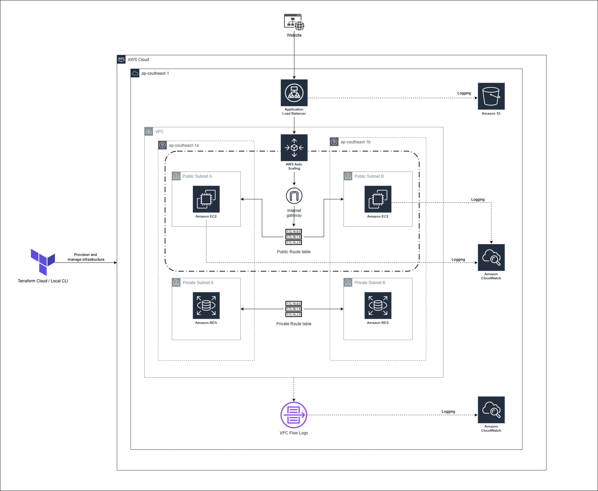 

The system is deployed into a custom VPC spanning two Availability Zones (<code>ap-southeast-1a/b</code>) to ensure high availability. The <strong>Web Tier</strong> is managed by an Auto Scaling Group (ASG) and distributed by an Application Load Balancer (ALB), while the <strong>Data Tier</strong> is strictly isolated in private subnets with restricted ingress.

<ol>
   <li>
      <strong>Client Ingress & Routing:</strong> Traffic enters via the <strong>Internet Gateway (IGW)</strong> and is intercepted by the <strong>Application Load Balancer</strong>. The ALB acts as the single entry point, offloading SSL (if configured) and performing health checks to ensure traffic only reaches healthy EC2 nodes.
   </li>
   <li>
      <strong>Elastic Compute & Scaling:</strong> The ASG maintains a minimum of 2 instances. It utilizes a <strong>Target Group</strong> to seamlessly register/deregister instances during scaling events or failovers, ensuring zero-downtime deployments.
   </li>
   <li>
      <strong>Multi-Layered Observability:</strong>
      <ul>
         <li><strong>Host Level:</strong> The CloudWatch Agent retrieves its <code>ssm:AmazonCloudWatch-linux-webapp</code> configuration to stream <code>/var/log/cloud-init-output.log</code> and application logs.</li>
         <li><strong>Network Level:</strong> <strong>VPC Flow Logs</strong> capture all IP traffic metadata to monitor for rejected connection attempts.</li>
         <li><strong>Access Level:</strong> <strong>ALB Access Logs</strong> are archived in <strong>Amazon S3</strong> for long-term auditability and traffic pattern analysis.</li>
      </ul>
   </li>
   <li>
      <strong>Secure Data Persistence:</strong> The Node.js application communicates with the <strong>RDS MySQL</strong> instance located in the Private Subnets. Security Groups are configured using <strong>Security Group Referencing</strong> (allowing 3306 ONLY from the Web Security Group), ensuring the database is never exposed to the public internet.
   </li>
   <li>
      <strong>The Logging & Auditing Ecosystem:</strong>
      <ul>
         <li><strong>S3 Bucket (ALB Access Logs):</strong> Every request hitting the Load Balancer is logged into a dedicated <strong>Amazon S3</strong> bucket. This provides a durable audit trail of client IPs, request paths, and response latencies, crucial for compliance and traffic analysis.</li>
         <li>
            <strong>CloudWatch (System & Network):</strong>
            <ul>
               <li><strong>Host Level:</strong> EC2 instances stream <code>/var/log/cloud-init-output.log</code> and application logs to <strong>CloudWatch Logs</strong>.</li>
               <li><strong>Network Level:</strong> <strong>VPC Flow Logs</strong> capture all IP traffic metadata to monitor for rejected connection attempts.</li>
            </ul>
         </li>
      </ul>
   </li>
   <li>
      <strong>IAM Roles & Security Governance:</strong>
      
Logging functionality is enabled through an <strong>IAM Instance Profile</strong> attached to the EC2 instances. This role follows the <strong>Principle of Least Privilege</strong>, granting specific permissions to:

      <ul>
         <li>Retrieve configurations from <strong>SSM Parameter Store</strong>.</li>
         <li>Write log streams to <strong>CloudWatch</strong> via the <code>CloudWatchAgentServerPolicy</code>.</li>
         <li>Allow the ALB service principal to write access logs to the <strong>S3 Bucket</strong> via a bucket policy.</li>
      </ul>
   </li>
</ol>

<a href="#readme-top">↑ Back to Top</a>

<h2 id="file-structure">File Structure</h2>
<pre>AWS-TERRAFORM-2-TIER-WEBAPP/
├── 📁 .github/               # GitHub Actions or workflows
│   └── workflows/             # CI/CD Pipeline Definitions
│       ├── cd.yml             # Production Deployment
│       ├── ci.yml             # Terraform PR Insights (Checkov, TFLint, Plan)
│       └── documentation.yml  # Automated Documentation Sync via terraform-docs
├── 📁 .terraform/            # Terraform working directory
├── 📁 assets/                # Project documentation and images
├── 📁 modules/               # Reusable infrastructure modules
│   ├── 📁 alb/               # Application Load Balancer configuration
│   ├── 📁 ec2/               # Compute tier configuration
│   │   ├── 📁 scripts/       # User data and initialization scripts (e.g., user_data.tftpl)
│   │   ├── main.tf           # EC2 Launch Template and ASG resources [cite: 33]
│   │   ├── outputs.tf        # EC2-specific output values
│   │   ├── providers.tf      # Version constraints (No cloud block!)
│   │   └── variables.tf      # EC2-specific input variables
│   ├── 📁 rds/              # Managed database configuration
│   ├── 📁 security_groups/   # Networking security rules
│   └── 📁 vpc/               # Virtual Private Cloud network setup
├── 📁 scripts/               # Automation & Validation Scripts
│   └── verify-deployment.sh   # Post-deployment test script
├── .gitignore                 # Files excluded from version control
├── .terraform.lock.hcl        # Provider dependency lock file
├── .pre-commit-config.yaml    # Local git-hook orchestration
├── .tflint.hcl                # TFLint AWS ruleset configuration
├── .checkov.yml               # Checkov scan ignore list
├── .terraform-docs.yml        # Config for terraform documentation during workflow
├── main.tf                    # Root module orchestrating all tiers
├── outputs.tf                 # Global output values (e.g., ALB DNS)
├── project-key.pem            # Private SSH key for EC2 access
├── providers.tf               # AWS provider and Terraform version config
└── README.md                  # Project documentation (Auto-injected by terraform-docs)
├── README.template.md         # Documentation template
├── terraform.tfstate          # Current state of deployed infrastructure
├── terraform.tfstate.backup   # Previous state backup
└── variables.tf               # Global input variables
</pre>

<a href="#readme-top">↑ Back to Top</a>

<h2 id="technical">Technical Reference</h2>
This section is automatically updated with the latest infrastructure details.

<b>Detailed Infrastructure Specifications</b>

<!-- BEGIN_TF_DOCS -->

{{ .Content }}

<!-- END_TF_DOCS -->

<a href="#readme-top">↑ Back to Top</a>

<h2 id="getting-started">Getting Started</h2>
<h3>Prerequisites</h3>
<ul>
  <li>AWS Account with Bedrock Claude 3.5 model access enabled.</li>
  <li>Terraform CLI (v1.5.0+) installed locally.</li>
  <li>Terraform Cloud account for remote state management.</li>
  <li><strong>Set your AWS Region:</strong> Set to whatever <code>aws_region</code> you want in <code>variables.tf</code>.</li>
</ul>

  

<h3>Terraform Cloud State Management</h3>
<ol>
   <li>Create a new <strong>Workspace</strong> with github version control workflow in Terraform Cloud.</li>
   <li>In the Variables tab, add the following <strong>Terraform Variables:</strong>
   </li>
   <li>
    Add the following <strong>Environment Variables</strong> (AWS Credentials):
    <ul>
      <li><code>AWS_ACCESS_KEY_ID</code></li>
      <li><code>AWS_SECRET_ACCESS_KEY</code></li>
   </ul>
   </li>
    <li>
      Run the command ni Terraform CLI:
      <pre>terraform login</pre>
    </li>
    <li>Create a token and follow the steps in browser to complete the Terraform Cloud Connection.</li>
    <li>
      Add the <code>backend</code> block in <code>terraform</code> code block</code>:
    <pre>backend "remote" {
  hostname     = "app.terraform.io"
  organization = &lt;your-organization-name&gt;
  workspaces {
    name = &lt;your-workspace-name&gt;
  }
}</pre>
   </li>
    <li>
      Run the command in Terraform CLI to migrate the state into Terraform Cloud:
      <pre>terraform init -migrate-state</pre>
    </li>
</ol>

<h3>Installation & Deployment</h3>
<ol>
    <li>
        <strong>Clone the Repository:</strong>
        <pre>git clone https://github.com/{{GITHUB_USER}}/{{REPO_NAME}}.git</pre>
    </li>
    <li>
        <strong>Provision Infrastructure:</strong> 
        <strong>Terraform Cloud</strong> → <strong>Initialize & Apply:</strong> Push your code to GitHub. Terraform Cloud will automatically detect the change, run a <code>plan</code>, and wait for your approval.
    </li>
    <li>
        <strong>Observe workflow:</strong> 
        <strong>GitHub (GitOps)</strong> → <strong>Github actions:</strong> Observe the process/workflow of CI/CD in the actions tab in GitHub.
    </li>
</ol>

<a href="#readme-top">↑ Back to Top</a>

<h2 id="gitops">GitOps & CI/CD Workflow</h2>

This project uses a fully automated GitOps pipeline to ensure code quality and deployment reliability. The <strong>Pre-commit</strong> framework implements a "Shift-Left" strategy, ensuring that code is formatted, documented, and secure before it ever leaves your machine.

<h3>Workflow</h3>
<ol>
  <li>
    <strong>Branch Protection Rulesets</strong> 
    To ensure high code quality and prevent unauthorized changes to the production environment, the <code>main</code> branch is governed by a <strong>GitHub Branch Ruleset</strong>.
    <ul>
      <li><strong>Pull Request Mandatory:</strong> No code can be pushed directly to <code>main</code>. All changes must originate from a feature branch and be merged via a Pull Request.</li>
      <li><strong>Required Status Checks:</strong> The <code>Infrastructure CI</code> (Terraform Plan & Static Analysis) must pass successfully before a merge is permitted.</li>
      <li><strong>Bypass Authority:</strong> The dedicated GitHub App is added to the Bypass List with "Always allow" permissions. This allows the bot to push documentation updates directly to <code>main</code> without being blocked by PR requirements.</li>
    </ul>
  </li>
  <li>
    <strong>Pre-commit</strong>
    <ul>
      <li><strong>Tool:</strong> Executes <code>terraform fmt</code>, <code>terraform validate</code>, <code>TFLint</code>, <code>terraform_docs</code> and <code>checkov</code> to ensure the code is clean.</li>
      <li><strong>Trigger:</strong> Runs on every <strong>git commit</strong>.</li>
      <li>
        <strong>Outcome:</strong> If any check fails, the commit is blocked. You fix the error, re-add the file, and commit again.
      </li>
    </ul>
  </li>
  <li>
    <strong>Continuous Integration (PR)</strong>
    <ul>
      <li><strong>Tool:</strong> Executes <code>terraform fmt -check</code>, <code>terraform validate</code> and <code>checkov</code>, then do <code>plan</code> and cost estimation and print it on PR.</li>
      <li><strong>Trigger:</strong> Runs on every <strong>Pull Request</strong>.</li>
      <li>
        <strong>Outcome:</strong> This acts as the "Gatekeeper" before code is merged to <code>main</code>.
      </li>
    </ul>
  </li>
  <li>
    <strong>Continuous Delivery (Deployment)</strong>
    <ul>
      <li><strong>Tool:</strong> Terraform Cloud + GitHub Actions OIDC.</li>
      <li><strong>Trigger:</strong> Merges to the <code>main</code> branch.</li>
      <li>
        <strong>Outcome:</strong> The pipeline verifies the infrastructure state and runs a post-deployment health check with(<code>health-check.sh</code> & <code>smoke-test-website.sh</code>).
      </li>
    </ul>
  </li>
  <li>
    <strong>Dynamically update readme documentation</strong>
    <ul>
      <li><strong>Tool:</strong> <code>terraform_docs</code> + GitHub Actions.</li>
      <li><strong>Trigger:</strong> Merges to the <code>main</code> branch.</li>
      <li>
        <strong>Outcome:</strong> The pipeline verifies the infrastructure state from Terraform Cloud, retrieve outputs from Terraform Cloud and update the readme documentation file dynamically.
      </li>
    </ul>
  </li>
</ol>

<h3>Prerequisites for GitOps</h3>
<ul>
  <li><strong>Repository Secret <code>TF_API_TOKEN</code>:</strong> Required for GitHub to communicate with Terraform Cloud.</li>
  <li><strong>Trigger:</strong> A GitHub Actions OIDC role (<code>GitHubActionRole</code>) allows the runner to verify AWS resources without long-lived keys.</li>
  <li>
      <strong>Automated Documentation via GitHub App:</strong> Instead of using a Personal Access Token (PAT) or the default <code>GITHUB_TOKEN</code>, this project uses a custom <strong>GitHub App</strong> for automated tasks. 
      <table>
         <thead>
            <tr>
               <td>Secret</td>
               <td>Description</td>
               <td>Source</td>
            </tr>
         </thead>
         <tbody>
            <tr>
               <td><code>BOT_APP_ID</code></td>
               <td>The unique numerical ID assigned to your GitHub App.</td>
               <td>App Settings > General</td>
            </tr>
            <tr>
               <td><code>BOT_PRIVATE_KEY</code></td>
               <td>The full content of the generated <code>.pem</code> private key file.</td>
               <td>App Settings > Private keys</td>
            </tr>
         </tbody>
      </table>
   </li>
</ul>

<a href="#readme-top">↑ Back to Top</a>

<a href="#readme-top">↑ Back to Top</a>

<h2 id="usage">Usage & Testing</h2>
<ol>
   <li>
      <h3>Web Tier Verification</h3>
      
Once the Auto Scaling Group shows <code>InService</code> instances:

      <ol>
         <li>
            <strong>Access the App:</strong> Copy the Public IP of any running instance (or the Load Balancer DNS if applicable) and paste it into your browser at port 3000. 
            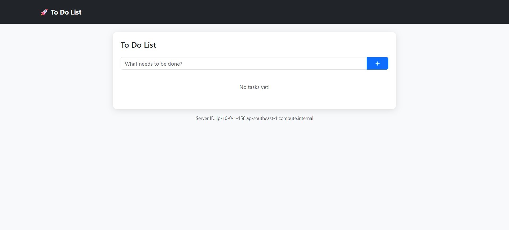
         </li>
         <li>
            <strong>Add an Item:</strong> Type a task (e.g., "Setup CloudWatch Alarms") in the input box and click Add. Verify the item appears in the list. 
            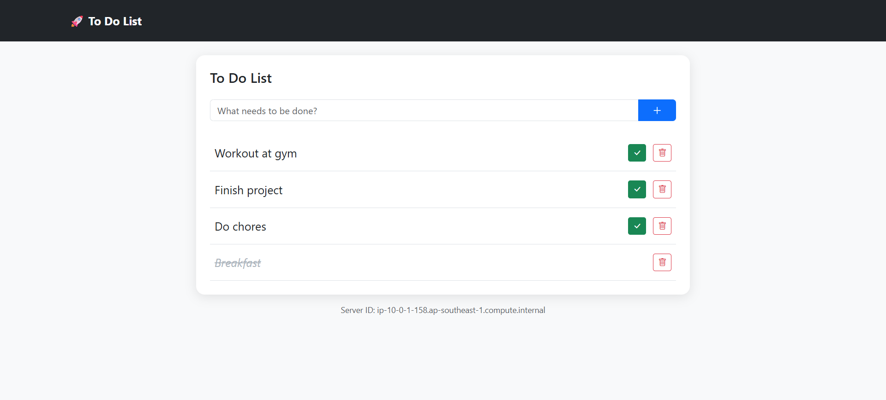
         </li>
         <li><strong>Mark Complete:</strong> Click the Complete button. The item should move or change status, confirming a <code>PUT</code> request to the RDS MySQL backend.</li>
         <li><strong>Delete an Item:</strong> Click <strong>Delete</strong>. Verify the item is removed from the UI and the database via a <code>DELETE</code> request.</li>
      </ol>
   </li>
   <li>
      <h3>Verification of Load Balancing (Traffic Distribution)</h3>
      
The application is designed to demonstrate horizontal scaling and stateless execution. You can observe the Load Balancer's "Round Robin" or "Least Outstanding Requests" algorithm in action by following these step:

      <ol>
         <li>
            <strong>Observe the Footer:</strong> The webpage UI displays the Metadata Instance ID of the specific EC2 server that processed the request.
         </li>
         <li>
            <strong>Refresh the Browser:</strong> By performing refresh repeatedly, you will notice the Server ID toggle between the two instances in the Auto Scaling Group. 
            
         </li>
         <li><strong>The Significance:</strong> This confirms that the ALB is successfully distributing ingress traffic across multiple Availability Zones. It also demonstrates that the application state is correctly decoupled; despite switching between different backend servers, the To-Do List data remains consistent because both instances are connected to the same central RDS MySQL database.</li>
      </ol>
   </li>
   <li>
      <h3>Validating Multi-AZ Resilience</h3>
      
Manually terminate one instance in the console. Watch the ASG Activity Tab; you will see the ASG detect the "Unhealthy" status and automatically spin up a replacement in a different subnet to maintain the desired capacity of 2.
 
      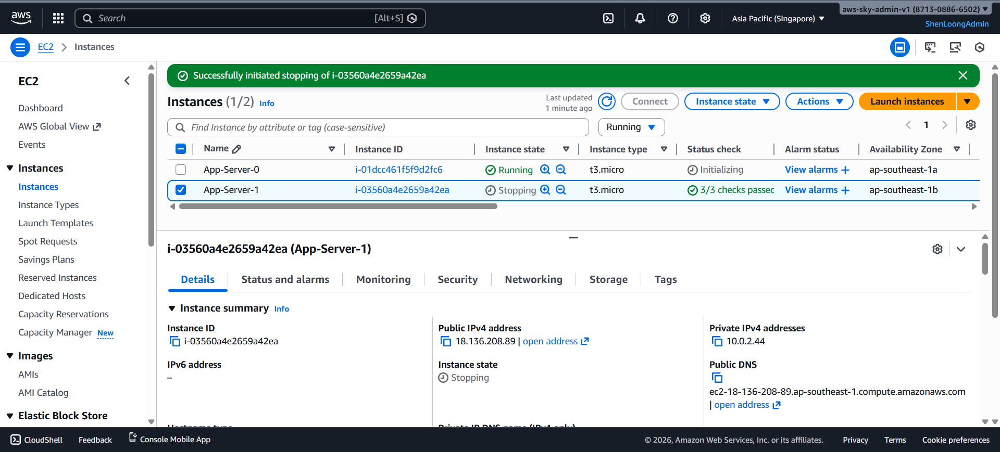
      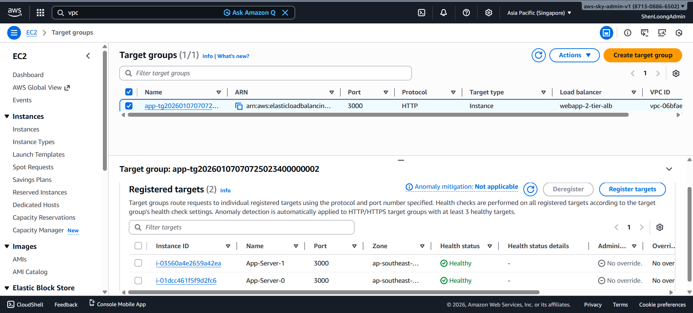
   </li>
   <li>
      <h3>ALB Access Log Audit</h3>
      <ol>
         <li>
            <strong>Generate Traffic:</strong> Click through your application for 5-10 minutes (add/delete some tasks).
         </li>
         <li>
            <strong>Verify S3 Storage:</strong> Navigate to the Amazon S3 Console and open your logging bucket (e.g., <code>webapp-alb-logs-...</code>).
         </li>
         <li>
            <strong>Inspect Logs:</strong> Follow the folder path: <code>AWSLogs/ &lt;ACCOUNT_ID&gt; /elasticloadbalancing/ &lt;REGION&gt; /</code>. 
            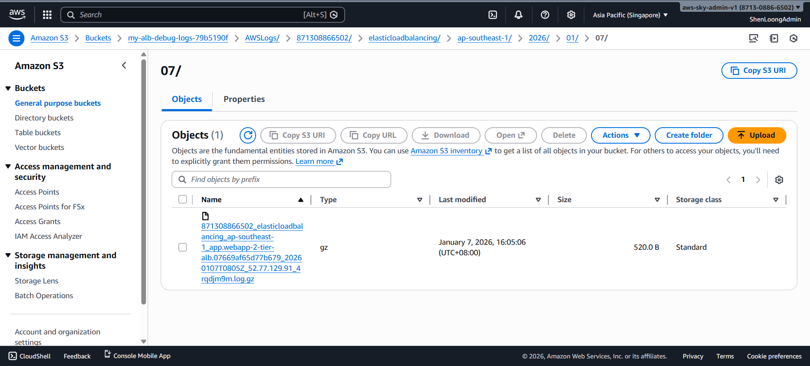
         </li>
         <li>
            <strong>Download the file:</strong> Extract it and view it in notepad 
            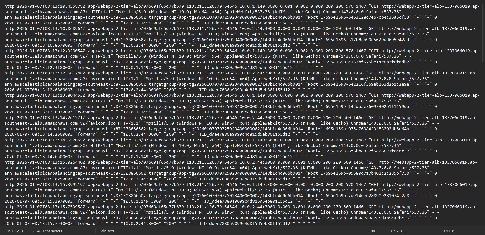
         </li>
      </ol>
   </li>
   <li>
      <h3>CloudWatch Log Verification</h3>
      <h4>Analyzing Security Group Effectiveness</h4>
      <ol>
         <li><strong>Generate a "Reject" Event:</strong> Attempt to SSH into your RDS database directly from your home computer. Since the RDS is in a private subnet, this connection will time out.</li>
         <li><strong>Verify in CloudWatch:</strong> Navigate to <strong>CloudWatch > Log Groups ></strong> <code>/aws/vpc/flow-logs-debug</code>.</li>
         <li>
            <strong>Search for Rejections:</strong> Look for logs where the <code>action</code> is <code>REJECT</code>. This confirms that your <strong>Security Group "Least Privilege"</strong> rules are actively blocking unauthorized external traffic. 
            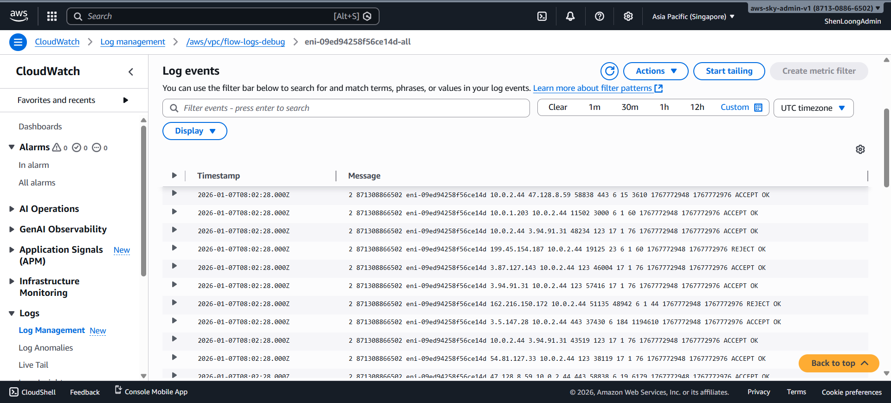
         </li>
      </ol>
      <h4>EC2 user data bootstrap log</h4>
      <ul>
         <li>
            Search for the log group <code>/aws/ec2/webapp-logs</code>. Note that logs are organized by Instance ID, allowing you to track logs even after the instance that created them has been terminated. 
            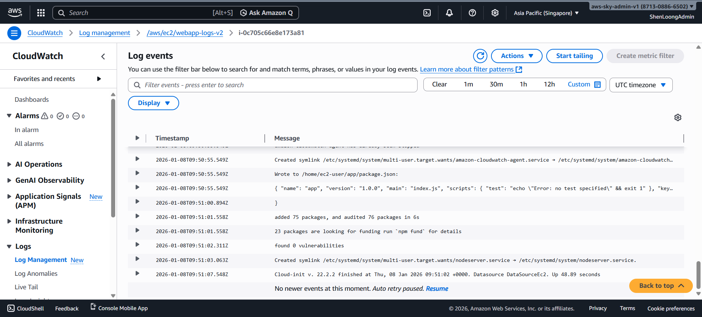
         </li>
      </ul>
   </li>
</ol>

<h3>🛠️ Advanced Debugging Tips</h3>

If the application is not responding or you notice issues with the initial setup, SSH into an instance and use these commands to diagnose the root cause.

 <strong>⚠️ IMPORTANT: Ensure you are operating in your Local Terminal linked to the Terraform Cloud Workspace before proceeding with these commands.</strong> 

<ol>
   <li>
      <h4>Connecting to the Instance</h4>
      <pre>ssh -i project-key.pem ec2-user@&lt;INSTANCE_PUBLIC_IP&gt;</pre>
      
<em>Access the virtual machine securely using your generated RSA private key.</em>

   </li>
   <li>
      <h4>Inspecting Initialization (Cloud-Init)</h4>
      
Cloud-init logs record the <code>UserData</code> execution during the first boot. Use these if Node.js or the CloudWatch Agent fails to install.

      <table>
         <thead>
            <tr>
               <th>Command</th>
               <th>Purpose</th>
            </tr>
         </thead>
         <tbody>
            <tr>
               <td><code>sudo tail -f /var/log/cloud-init-output.log</code></td>
               <td>
                  <strong>Live Monitor:</strong> Watch the setup script execute in real-time. 
                  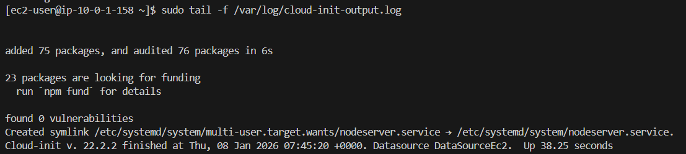
               </td>
            </tr>
            <tr>
               <td><code>sudo cat /var/log/cloud-init-output.log</code></td>
               <td><strong>Full Audit:</strong> View the entire history of the installation phase.</td>
            </tr>
            <tr>
               <td><code>sudo cat /var/log/cloud-init-output.log | grep -i "error"</code></td>
               <td><strong>Error Hunt:</strong> Quickly filter for specific installation or network failures.</td>
            </tr>
         </tbody>
      </table>
   </li>
   <li>
      <h4>Application & Service Logs</h4>
      
The application runs as a background service managed by <code>systemd</code>. Use these to verify if the Node.js API is active.

      <table>
         <thead>
            <tr>
               <th>Command</th>
               <th>Purpose</th>
            </tr>
         </thead>
         <tbody>
            <tr>
               <td><code>sudo systemctl status nodeserver</code></td>
               <td>
                  <strong>Heartbeat Check:</strong> Verify if the <code>nodeserver</code> service is <code>active (running)</code>. 
                  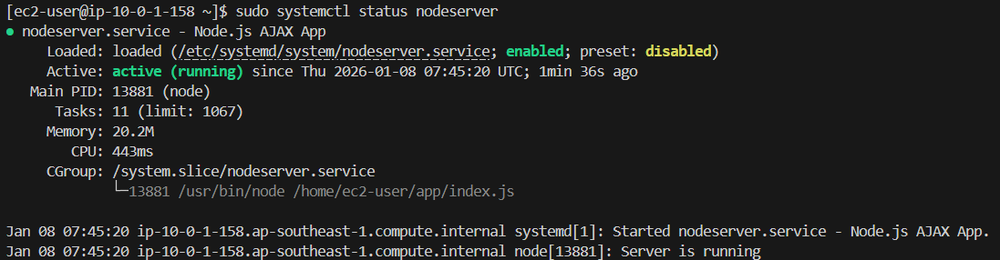
               </td>
            </tr>
            <tr>
               <td><code>sudo journalctl -u nodeserver.service -n 50 --no-pager</code></td>
               <td><strong>Code Logs:</strong> View the last 50 lines of application output (console logs).</td>
            </tr>
            <tr>
               <td><code>curl -I http://localhost:3000</code></td>
               <td>
                  <strong>Local Health Check:</strong> Confirm the web server is responding inside the instance. 
                  
               </td>
            </tr>
         </tbody>
      </table>
   </li>
   <li>
      <h4>Database Connectivity Tier</h4>
      
Verify that your EC2 instance can talk to the Private RDS instance across subnets. <strong>Note:</strong> You must install the MySQL client on the EC2 instance first to run these queries.

      <table>
         <thead>
            <tr>
               <th>Step</th>
               <th>Command</th>
            </tr>
         </thead>
         <tbody>
            <tr>
               <td><strong>1. Install Client</strong></td>
               <td><code>sudo dnf install mariadb105 -y</code></td>
            </tr>
            <tr>
               <td><strong>2. Test Connection</strong></td>
               <td><code>mysql -h <strong>&lt;RDS_ENDPOINT&gt;</strong> -u admin -p<strong>&lt;PASSWORD&gt;</strong> webapp_2_tier_db -e "SELECT * FROM items;"</code></td>
            </tr>
         </tbody>
      </table>
      
<em><strong>Troubleshooting:</strong> If the connection times out after installing the client, ensure the RDS Security Group has an <strong>Inbound Rule</strong> allowing Port 3306 from the EC2 Security Group ID.</em>

   </li>
</ol>

<a href="#readme-top">↑ Back to Top</a>

<h2 id="roadmap">Roadmap</h2>
<ul>
   <li>[x] <strong>Multi-AZ Deployment:</strong> Instances distributed across different subnets.</li>
   <li>[x] <strong>Config-as-Code:</strong> SSM Parameter Store for agent settings.</li>
   <li>[x] <strong>Cost Controls:</strong> Automated log retention and Infrequent Access tiers.</li>
   <li>[x] <strong>CI/CD Integration:</strong> Automate Terraform Apply via GitHub Actions.</li>
   <li>[x] <strong>ALB Integration:</strong> Add an Application Load Balancer for a single entry point.</li>
   <li>[x] <strong>Traffic Auditing:</strong> S3-based ALB access logging for long-term compliance.</li>
   <li>[x] <strong>Network Visibility:</strong> VPC Flow Logs integrated with CloudWatch for deep packet metadata analysis.</li>
   <li>[ ] <strong>HTTPS:</strong> Implement SSL termination using AWS Certificate Manager.</li>
   <li>[ ] <strong>Target Tracking Scaling:</strong> Implement <code>aws_autoscaling_policy</code> to scale out based on CPU utilization (Future Enhancement).</li>
   <li>[ ] <strong>Bastion Host:</strong> Move the database and web servers to private subnets for enhanced security.</li>
   <li>[ ] <strong>Advanced Analytics:</strong> Implement <strong>Amazon Athena</strong> queries to analyze the S3 access logs for performance bottlenecks.</li>
   <li>[ ] <strong>Anomaly Detection:</strong> Implement <strong>Amazon GuardDuty</strong> to automatically flag suspicious patterns (like port scanning) found in the Flow Logs.</li>
</ul>

<a href="#readme-top">↑ Back to Top</a>

<h2 id="challenges">Challenges</h2>
<table>
   <thead>
      <tr>
         <th>Challenge</th>
         <th>Solution</th>
      </tr>
   </thead>
   <tbody>
      <tr>
         <td><strong>Logging Visibility</strong></td>
         <td>Amazon Linux 2023 removed <code>/var/log/messages</code>. Switched agent tracking to <code>cloud-init-output.log</code> and application-specific paths.</td>
      </tr>
      <tr>
         <td><strong>The "3 Instances" Mystery</strong></td>
         <td>Observation of 3 instances running simultaneously during updates. Learned that the min_healthy_percentage (50%) forces ASG to launch a new instance before killing the old one.</td>
      </tr>
      <tr>
         <td><strong>ASG Grace Periods</strong></td>
         <td>Default cooldowns and grace periods (300s) caused delays. Adjusted <code>health_check_grace_period</code> for faster development cycles.</td>
      </tr>
      <tr>
         <td><strong>Terraform Cloud State Migration</strong></td>
         <td>Moving to a remote backend caused <code>local_file</code> resources to "flap" (recreate on every apply). I learned that local file resources are incompatible with ephemeral cloud runners and shifted to managing keys via sensitive outputs.</td>
      </tr>
      <tr>
         <td><strong>Log Class UI Errors</strong></td>
         <td>Encountered "Operation not supported" errors when viewing <code>INFREQUENT_ACCESS</code> logs. Learned that while IA saves costs, it has a UI propagation delay and limited "Live Tail" support compared to <code>STANDARD</code> logs.</td>
      </tr>
      <tr>
         <td><strong>IAM Propagation</strong></td>
         <td>Encountered <code>AccessDenied</code> during initial agent boot. Ensured the <code>AmazonSSMManagedInstanceCore</code> policy was attached to the Instance Profile.</td>
      </tr>
      <tr>
         <td><strong>Free Tier Constraints</strong></td>
         <td>To avoid unexpected costs, I limited the <code>max_size</code> of the ASG and deferred automatic scaling policies. This highlights the balance between high-availability architecture and budget management in a dev/test environment.</td>
      </tr>
      <tr>
         <td><strong>Load Balancer Integration</strong></td>
         <td>Configuring the <code>aws_lb_target_group</code> to correctly perform health checks on Port 3000. Learned that the ASG must be explicitly attached to the Target Group to receive traffic.</td>
      </tr>
      <tr>
         <td><strong>Public vs. Private Security</strong></td>
         <td>Successfully isolated the RDS in a private subnet. Navigating the challenge of allowing EC2-to-RDS communication while keeping the database shielded from the public internet.</td>
      </tr>
      <tr>
         <td><strong>Statelessness</strong></td>
         <td>To achieve this, the Node.js application was built to be stateless. No session data is stored on the local disk of the EC2 instance; all persistent data is offloaded to RDS. This allows the ALB to swap servers mid-session without the user losing their progress.</td>
      </tr>
      <tr>
         <td><strong>ALB Algorithms</strong></td>
         <td>By default, the ALB uses a round-robin approach at the request level. If you don't see the ID change immediately, it may be due to HTTP Keep-Alive (the browser reusing a connection) or Stickiness settings (which are disabled in this project to better demonstrate load distribution).</td>
      </tr>
   </tbody>
</table>

<a href="#readme-top">↑ Back to Top</a>

<h2 id="well-architected">🏛️ AWS Well-Architected Framework Alignment</h2>

This project demonstrates a <strong>Cost-Optimized Development Environment</strong>, prioritizing security and observability over high-availability redundancy to minimize AWS expenditure while maintaining production-grade standards.

<table width="100%">
   <thead>
      <tr>
         <th width="25%">Pillar</th>
         <th>Technical Implementation & Alignment</th>
      </tr>
   </thead>
   <tbody>
      <tr>
         <td align="center">  
            <strong>Operational Excellence</strong>
         </td>
         <td>
            <ul>
               <li><strong>Infrastructure as Code:</strong> 100% of the stack is provisioned via Terraform, allowing for consistent, repeatable deployments.</li>
               <li><strong>Automated Observability:</strong> Integrated CloudWatch Agent via SSM Parameter Store for automated log collection from EC2 instances without manual intervention.</li>
               <li><strong>GitOps CI/CD:</strong> Implemented a fully automated pipeline for testing, linting, and deploying infrastructure changes via GitHub Actions and Terraform Cloud.</li>
               <li><strong>Standardized Deployment:</strong> Uses a modularized file structure to separate networking, compute, and database logic for better maintainability.</li>
            </ul>
         </td>
      </tr>
      <tr>
         <td align="center">  
            <strong>Security</strong>
         </td>
         <td>
            <ul>
               <li><strong>Network Isolation:</strong> RDS database is strictly isolated in private subnets with no public internet ingress.</li>
               <li><strong>Traffic Control:</strong> Security Groups utilize <strong>referencing</strong> (e.g., RDS only allows 3306 from the Web SG) rather than open IP ranges.</li>
               <li><strong>Auditability:</strong> VPC Flow Logs and ALB Access Logs provide a complete audit trail of all network traffic and client requests.</li>
            </ul>
         </td>
      </tr>
      <tr>
         <td align="center">  
            <strong>Reliability & Failure Design</strong>
         </td>
         <td>
            <ul>
               <li><strong>Data Persistence:</strong> RDS MySQL managed database provides automated backups and multi-AZ failover capabilities.</li>
               <li><strong>Manual Scaling:</strong> Simplifies architecture by avoiding ASG complexity, allowing for predictable resource management in a dev/test context.</li>
               <li><strong>Health Monitoring:</strong> The Application Load Balancer performs active health checks to notify of instance downtime via CloudWatch Alarms.</li>
            </ul>
         </td>
      </tr>
      <tr>
         <td align="center">  
            <strong>Performance Efficiency</strong>
         </td>
         <td>
            <ul>
               <li><strong>Elastic Load Balancing:</strong> Application Load Balancer (ALB) ensures efficient traffic distribution across the healthy compute fleet.</li>
               <li><strong>Optimized Compute:</strong> Leveraged <code>t3.micro</code> instances for the web tier and managed RDS for optimized database performance.</li>
               <li><strong>Configuration as Code:</strong> Using SSM to push agent configurations avoids manual "SSH-to-all" performance bottlenecks during updates.</li>
            </ul>
         </td>
      </tr>
      <tr>
         <td align="center">  
            <strong>Cost Optimization</strong>
         </td>
         <td>
            <ul>
               <li><strong>Free-Tier Alignment:</strong> Utilizes <code>t3.micro</code> instances and a single RDS instance to stay within the AWS Free Tier.</li>
               <li><strong>Single-AZ Strategy:</strong> Eliminated Multi-AZ and Cross-Zone Data Transfer costs, reducing monthly spend by ~50% compared to a HA setup.</li>
               <li><strong>Log Retention:</strong> Set to 7 days to prevent unnecessary storage costs in CloudWatch.</li>
            </ul>
         </td>
      </tr>
      <tr>
         <td align="center">
            <strong>Sustainability</strong>
         </td>
         <td>
            <ul>
               <li><strong>Managed Services:</strong> Utilizing RDS reduces the energy overhead of running manual database servers.</li>
            </ul>
         </td>
      </tr>
   </tbody>
</table>

<a href="#readme-top">↑ Back to Top</a>

<h2 id="acknowledgements">Acknowledgements</h2>

  Special thanks to <strong>Tech with Lucy</strong> for the architectural inspiration and excellent AWS tutorials that helped shape this pipeline.

<ul>
  <li>
    See her youtube channel here: <a href="https://www.youtube.com/@TechwithLucy" target="_blank">Tech With Lucy</a>
  </li>
  <li>
    Watch her video here: <a href="https://www.youtube.com/watch?v=0hJxcBdRlYw" target="_blank">5 Intermediate AWS Cloud Projects To Get You Hired (2025)</a>
  </li>
</ul>

<a href="#readme-top">↑ Back to Top</a>

[contributors-shield]: https://img.shields.io/github/contributors/{{GITHUB_USER}}/{{REPO_NAME}}.svg?style=for-the-badge
[contributors-url]: {{REPO_URL}}/graphs/contributors
[forks-shield]: https://img.shields.io/github/forks/{{GITHUB_USER}}/{{REPO_NAME}}.svg?style=for-the-badge
[forks-url]: {{REPO_URL}}/network/members
[stars-shield]: https://img.shields.io/github/stars/{{GITHUB_USER}}/{{REPO_NAME}}.svg?style=for-the-badge
[stars-url]: {{REPO_URL}}/stargazers
[issues-shield]: https://img.shields.io/github/issues/{{GITHUB_USER}}/{{REPO_NAME}}.svg?style=for-the-badge
[issues-url]: {{REPO_URL}}/issues
[license-shield]: https://img.shields.io/github/license/{{GITHUB_USER}}/{{REPO_NAME}}.svg?style=for-the-badge
[license-url]: {{REPO_URL}}/blob/master/LICENSE.txt
[linkedin-shield]: https://img.shields.io/badge/-LinkedIn-black.svg?style=for-the-badge&logo=linkedin&colorB=555
[linkedin-url]: https://linkedin.com/in/si-kai-tan
[ci-shield]: https://github.com/{{GITHUB_USER}}/{{REPO_NAME}}/actions/workflows/ci.yml/badge.svg
[ci-url]: https://github.com/{{GITHUB_USER}}/{{REPO_NAME}}/actions/workflows/ci.yml
[cd-shield]: https://github.com/{{GITHUB_USER}}/{{REPO_NAME}}/actions/workflows/cd.yml/badge.svg
[cd-url]: https://github.com/{{GITHUB_USER}}/{{REPO_NAME}}/actions/workflows/cd.yml
[docs-shield]: https://github.com/{{GITHUB_USER}}/{{REPO_NAME}}/actions/workflows/documentation.yml/badge.svg
[docs-url]: https://github.com/{{GITHUB_USER}}/{{REPO_NAME}}/actions/workflows/documentation.yml
